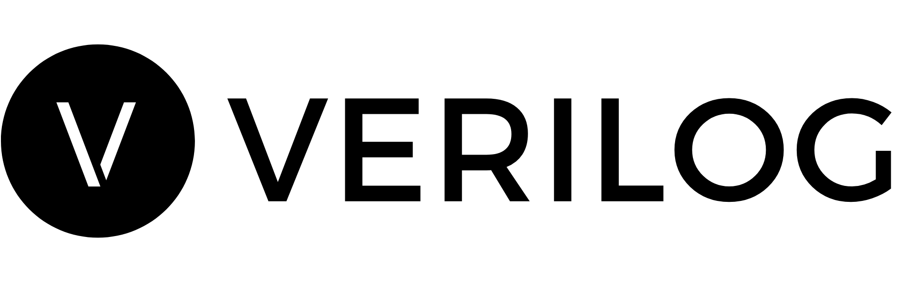

  
  

    
  

  
A curated list of awesome <a href="https://www.verilog.solutions/">Verilog</a> resources, information, audits, standards and more.

---
## About Verilog Solutions

Founded by a group of cryptography researchers and smart contract engineers in North America, Verilog Solutions elevates the security standard for Web3 ecosystems by being a full-stack Web3 security firm covering smart contract security, consensus security, and operational security for Web3 projects.

Verilog Solutions team works closely with major ecosystems and Web3 projects and applies a quality above quantity approach with a continuous security model. Verilog Solutions onboards the best and most innovative projects and provides the best-in-class advisory service on security needs, including on-chain and off-chain components.

---
## :file_folder: Audit
| our engineering engagement with project teams

### :briefcase: BendDAO Audit
A decentralized peer-to-pool-based NFT liquidity protocol. Depositors provide ETH liquidity to the lending pool to earn interest, while borrowers can borrow ETH from the lending pool using NFTs as collateral.

| Title           | Audit Report Link                            | Date        |
| --------------- | -------------------------------------------- | ----------- |
| Lending Protocol| coming soon | May 24, 2022|

### :briefcase: STEPN Audit
A Game-Fi/Social-Fi Web3 application. Users could acquire STEPN NFT sneakers and earn rewards by engaging in outdoor activities.

| Title           | Audit Report Link                            | Date        |
| --------------- | -------------------------------------------- | ----------- |
| STEPN           | coming soon | June 3, 2022|

### :briefcase: Gnosis Audit
GNO token is used in various GNO ecosystem products. GNO ecosystem includes various applications and infrastructure, such as Gnosis Auction, Gnosis Safe, and Gnosis Chain. Gnosis Beacon Chain is currently live and secured with GNO token, and the Gnosis Beacon Chain will merge with Gnosis Chain later.

| Title           | Audit Report Link                            | Date        |
| --------------- | -------------------------------------------- | ----------- |
| GNO Token V2.0.0| https://notion.verilog.solutions/audit/gno_token | April 22, 2022|

### :briefcase: WOOFi Swap Audit
Unlike popular Automated Market Making (AMM) or Proactive Market Making (PMM), WOOFi Swap’s Sythethetic Proactive Market Making (sPMM) is a brand new market-making algorithm that can successfully solve the slippage issue in Decentralized Exchange (DEX) by simulating order book structure in Centralized Exchange (CEX).

| Title           | Audit Report Link                            | Date        |
| --------------- | -------------------------------------------- | ----------- |
| WOOFi Swap      | coming soon | October 17, 2021 |

### :briefcase: Vesta Finance Audit
Vesta Finance is an Arbitrum-based lending protocol. Users can collateralize ETH and other supported assets to borrow $VST, which is Vesta Finance’s stablecoin. Vesta will support other collateral after the launch.

| Title           | Audit Report Link                            | Date        |
| --------------- | -------------------------------------------- | ----------- |
| Vesta Finance   | coming soon | January 30, 2022|

### :briefcase: Ubeswap Audit
A mobile-first DeFi exchange on the Celo network. Ubeswap provides decentralized exchange and automated market marker protocol for Celo assets. Ubeswap is recently adding new features including limit order.

| Title           | Audit Report Link                            | Date        |
| --------------- | -------------------------------------------- | ----------- |
| Ubeswap         | coming soon  | March 20, 2022 |

### :briefcase: Cronus Finance Audit
Cronus Finance is an AMM DEX deployed on the EVMOS ecosystem. A portion of Cronus Finance’s code is based on SushiSwap, which features liquidity mining rewards and governance token staking. It is worth noting that Cronus Finance also implemented new features such as a Stable Cronus Staking that converts LP fees into stablecoins and allows $sCRN holders to claim exchange fees denominated in stablecoins.

| Title           | Audit Report Link                            | Date        |
| --------------- | -------------------------------------------- | ----------- |
| Cronus Finance Protocol| https://notion.verilog.solutions/audit/cronus_finance | June 15, 2022|

### :briefcase: Untangle Protocol Audit
Untangled Protocol is a decentralized lending and liquidity protocol for
real-world asset collaterals.

| Title           | Audit Report Link                            | Date        |
| --------------- | -------------------------------------------- | ----------- |
| Untangle Protocol| https://notion.verilog.solutions/audit/untangle_finance| June 3, 2022|

### :briefcase: YuzuSwap Audit
One of the first DEX projects for the Emerald paratime on the Oasis Network. YuzuSwap is an AMM DEX with innovative trading incentive designs, such as the trading pool share token (TPST).

| Title           | Audit Report Link                            | Date        |
| --------------- | -------------------------------------------- | ----------- |
| YuzuSwap DEX    | coming soon | January 4, 2022|
| YuzuSwap Staking Contracts| coming soon | March 30, 2022|

### :briefcase: Fountain Protocol Audit
Fountain Protocol is one of the first Lending protocols on the Emerald Paratime of Oasis Network.

| Title           | Audit Report Link                            | Date        |
| --------------- | -------------------------------------------- | ----------- |
| Fountain Protocol| coming soon  |February 18, 2022|
| Fountian Protocol Incremental Audit| coming soon | April 12, 2022|

### :briefcase: TGT Finance Audit
TGT Protocol is one of the first lending protocols and margin trading platforms on the Emerald Paratime of Oasis Network.

| Title           | Audit Report Link                            | Date        |
| --------------- | -------------------------------------------- | ----------- |
| TGT Protocol| coming soon |February 24, 2022|

---
## :round_pushpin: Severity Categories Standards
| smart contract risk categorites

| Severity      | Description |
| ------------- | ----------- |
| **High**      |Issues that are highly exploitable security vulnerabilities. It may cause direct loss of funds / permanent freezing of funds. All high severity issues should be resolved.|
| **Medium**    |Issues that are only exploitable under some conditions or with some privileged access to the system. Users’ yields/rewards/information is at risk. All medium severity issues should be resolved unless there is a clear reason not to.                                   |
| **Low**       |Issues that are low risk. Not fixing those issues will not result in the failure of the system. A fix on low severity issues is recommended but subject to the clients’ decisions.    |
| **Informational** |Issues that pose no risk to the system and are related to the security best practices. Not fixing those issues will not result in the failure of the system. A fix on informational issues or adoption of those security best practices-related suggestions is recommended but subject to clients’ decision. |

---
## :triangular_flag_on_post: Status Categories
| smart contract risk categorites

| Status        | Description |
| ------------- | ----------- |
| **Unresolved**        |The issue is not acknowledged and not resolved.|
| **Partially Resolved**|The issue has been partially resolved.         |
| **Acknowledged**      |The Finding / Suggestion is acknowledged but not fixed /                        not implemented.                               |
| **Resolved**          |The issue has been sufficiently resolved       |     

---
## :office: Official Channels
| Verilog's official channel list

| Channels      | Link                                |
| ------------- | ----------------------------------- |
| **Website**   |https://www.verilog.solutions/       |
| **Twitter**   |https://twitter.com/verilog_audit    |
| **Github**    |https://github.com/Verilog-Solutions |
| **Email**     |audit@verilog.solutions              |
| **Telegram**  |BD Lead: https://t.me/dexchen        |

---
## Disclaimer

Verilog Solutions receives compensation from one or more clients for performing the smart contract and auditing analysis contained in these reports. The report created is solely for Clients and published with their consent. As such, the scope of our audit is limited to a review of code, and only the code we note as being within the scope of our audit is detailed in this report. It is important to note that the Solidity code itself presents unique and unquantifiable risks since the Solidity language itself remains under current development and is subject to unknown risks and flaws. Our sole goal is to help reduce the attack vectors and the high level of variance associated with utilizing new and consistently changing technologies. Thus, Verilog Solutions in no way claims any guarantee of security or functionality of the technology we agree to analyze.

In addition, Verilog Solutions reports do not provide any indication of the technologies proprietors, business, business model, or legal compliance. As such, reports do not provide investment advice and should not be used to make decisions about investment or involvement with any particular project. Verilog Solutions has the right to distribute the Report through other means, including via Verilog Solutions publications and other distributions. Verilog Solutions makes the reports available to parties other than the Clients (i.e., “third parties”) – on its website in hopes that it can help the blockchain ecosystem develop technical best practices in this rapidly evolving area of innovation.
